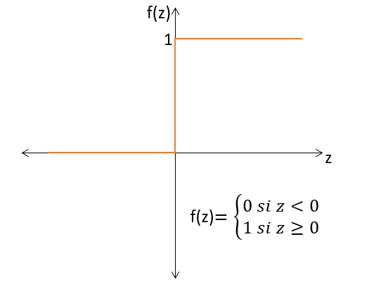

# NEURONA ARTIFICIAL:

## Áreas multidisciplinares

Las áreas de la neurociencia, la psicología y la inteligencia artificial confluyen con el fin de desarrollar modelos bio-inspirados que imitan estructuras y procesos biológicos para desarrollar algoritmos más eficientes y adaptativos.
La neurociencia por su parte estudia el sistema nervioso particularmente el cerebro, para entender cómo procesa la información, aprende y se adapta. Este conocimiento inspira el diseño de redes neuronales artificiales, que simulan el comportamiento neuronal biológico.
Por otro lado, la psicología, contribuye a entender el comportamiento humano, la cognición y las emociones, con el fin de crear sistemas bio-inspirados más realistas, en este caso una de las áreas de más influencia son las teorías del aprendizaje, procesos perceptivos, emociones y toma de decisiones.
En este sentido, existen muchas aplicaciones en este nuevo y apasionante campo en el cual confluyen muchas de las áreas del conocimiento humano y la vida en general.

## Breve historia

Warren McCulloch y Walter Pitts (1943) desarrollaron uno de los primeros modelos teóricos de inteligencia artificial basado en tres pilares:

* La fisiología de las neuronas.
* La lógica proposicional.
* La teoría de la computación. 

Su modelo de neuronas artificiales consistía en unidades "activadas" o "desactivadas," según la estimulación de las neuronas vecinas. Estas neuronas artificiales podían implementar funciones lógicas básicas (como AND, OR y NOT) y realizar cualquier cálculo computable mediante redes interconectadas.
Donald Hebb (1949) amplió estos conceptos al proponer una regla de aprendizaje, conocida como aprendizaje Hebbiano, que describe cómo fortalecer las conexiones neuronales en función de la actividad simultánea entre neuronas. Esta idea sigue siendo relevante en los modelos de redes neuronales modernas.
Este trabajo sentó las bases para las redes neuronales artificiales y la inteligencia artificial contemporánea. (Russell, 2004)

Por otra parte, cabe destacar que Alan Turing, en su artículo Computing Machinery and Intelligence (1950), sentó las bases de la inteligencia artificial al introducir conceptos clave como la prueba de Turing, el aprendizaje automático, los algoritmos genéricos y el aprendizaje por refuerzo. Este trabajo visionario marcó un hito inicial en el desarrollo de la IA. (Russell, 2004)

En la década de 1950 surge el campo de la IA como un área formal, en estos años, aparecen investigadores como Marvin Minsky, John McCarthy y Claude Shannon los cuales discutieron cómo construir máquinas capaces de "pensar". De igual manera, John Von Neumann, contribuyó al desarrollo de arquitecturas computacionales que implementaron algoritmos más avanzados. (Russell, 2004)

En la misma década por el año 1958, curiosamente un psicólogo, el señor Frank Rosenblatt, inspirado por los trabajos de McCulloch y Pitts, desarrolló el perceptrón. El perceptrón es un clasificador binario o discriminador lineal, el cual genera una predicción basándose en un algoritmo combinado con el peso de las entradas. (Telefonicatech, 2018)

## Entendiendo el perceptrón de Rosenblatt

Para entender el perceptrón de Rosenblatt, es fundamental comprender cómo funciona el cerebro humano. Este presenta una organización básica que incluye un "mapa" del campo visual en las conexiones entre la retina y el cerebro. Sin embargo, en las áreas de asociación, responsables del aprendizaje y la memoria, las conexiones se vuelven más complejas y aleatorias, integrando estímulos de diferentes sentidos.
En estas áreas, los estímulos llegan a capas superficiales mientras las salidas provienen de capas más profundas, con circuitos de retroalimentación que refuerzan las conexiones activas. Al llegar los impulsos a la corteza motora, se restaura un orden coherente mediante un "mapa" de la superficie del cuerpo, permitiendo generar respuestas musculares específicas y relevantes a los estímulos visuales procesados. (Rosenblatt, 1958)

<div style="text-align: center;">
    
    <p><em>Figura 1. Organización de un cerebro biológico (Las áreas en rojo, indican células activas, respondiendo a la letra X.)</em></p>
</div>

Por otra parte, La Figura 2 describe la estructura del perceptrón, un sistema inspirado en el cerebro biológico que realiza funciones como percepción, reconocimiento, memoria y selección de respuestas. Aunque similar al cerebro, presenta diferencias clave:
1.	Proyección directa: Los puntos sensoriales se conectan directamente a unidades asociativas seleccionadas al azar, sin necesidad de un área de proyección biológica.
2.	Respuestas binarias: Las unidades de respuesta operan en estados simples (activado, desactivado o neutral), simplificando las respuestas biológicas más complejas.
3.	Función combinada: Las unidades de respuesta integran las funciones de asociación y control motor, transmitiendo retroalimentación a las mismas unidades que las activaron inicialmente.
Esto simplifica su estructura, manteniendo funcionalidad similar al cerebro. (Rosenblatt, 1958)

<div style="text-align: center;">
    
    <p><em>Figura 2. Organización del perceptrón</em></p>
</div>

Marvin Minsky y Seymour Papert analizaron críticamente el perceptrón en su libro Perceptrons: An Introduction to Computational Geometry (1969). Si bien reconocieron su importancia como modelo inicial de redes neuronales y su capacidad para resolver problemas linealmente separables, también destacaron sus limitaciones. (Russell, 2004)
Principalmente, señalaron que los perceptrones de una sola capa no podían resolver problemas no linealmente separables, como el operador XOR, y explicaron que esta incapacidad era fundamental en su diseño. (Géron, 2019)

Estas críticas llevaron a una disminución del interés en las redes neuronales durante las décadas de 1970 y 1980, un periodo conocido como el "invierno de la IA". (Russell, 2004)

Sin embargo, el desarrollo posterior de redes neuronales multicapa y algoritmos de aprendizaje más avanzados demostró que los problemas identificados por Minsky y Papert podían superarse. (Géron, 2019)

## Matemática del perceptrón

Matemáticamente, sea la función z, una suma ponderada de dos entradas:

$$ z = w_1 x_1 + w_2 x_2 + b $$

Y teniendo una función escalón unitario f(z):

<div style="text-align: center;">
    
    <p><em>Figura 3. Función escalón unitario</em></p>
</div>

Se realiza la función compuesta a z con la función escalón unitario, obteniendo:

$$ f(z) = \begin{cases} 
0 & \text{si } w_1 x_1 + w_2 x_2 - umbral < 0 \\
1 & \text{si } w_1 x_1 + w_2 x_2 - umbral \geq 0
\end{cases} $$

Se define b como el umbral, con el fin de activar la neurona cuando dicho umbral es superado.

$$ - \text{umbral} = b $$

Quedando de esta manera la función:

$$ f(z) = \begin{cases} 
0 & \text{si } w_1 x_1 + w_2 x_2 + b < 0 \\
1 & \text{si } w_1 x_1 + w_2 x_2 + b \geq 0
\end{cases} $$

Quedando finalmente el modelo de neurona del perceptrón original:

$$ f(z) = \begin{cases} 
0 & \text{si } w_1 x_1 + w_2 x_2 < umbral \\
1 & \text{si } w_1 x_1 + w_2 x_2 \geq umbral
\end{cases} $$

Este modelo, es el descrito por McCulloch y Pitts, los cuales propusieron para describir el tipo de operaciones que realizan las neuronas biológicas en este caso un modelo binario (Prieto, 2000). Después como se mencionó en los parrafos anteriores, Frank Rosenblatt desarrollaría el perceptrón, modelado de la siguiente forma:

<div style="text-align: center;">
    
    <p><em>Figura 4. Modelado matemático del perceptrón</em></p>
</div>

La suma ponderada, recuerda a una regresión lineal:

$$ f(Z) = XW + \Theta $$

* Los pesos corresponden a la matriz W, son los parámetros del modelo.
* La matriz X son las entradas (En este caso números).
* El vector de sesgo ϴ.

Entonces se puede pensar que dentro de una neurona existe una regresión lineal.

### Ejemplo para dos entradas: X1 y X2

Por lo tanto, como se mecionó anteriormente, si a XW+ϴ le hacemos pasar por una función escalón unitario, se tendría:

$$ Si:f(z) = \begin{cases} 
0 & \text{si } z < 0 \\
1 & \text{si } z \geq 0
\end{cases} $$

Entonces:

$$ f(z) = w_1 x_1 + w_2 x_2 + b $$

Con:

$$ f(z) = 0 $$

Se tiene:

$$ w_1 x_1 + w_2 x_2 + b < 0 $$

$$ F(z) = 0 \rightarrow x_2 = -\frac{w_1}{w_2} x_1 - \frac{b}{w_2} $$

Por lo cual se tendría una recta, en dos dimensiones, con pesos w1 y w2 que modifican la pendiente de la recta y los parámetros b y w2, modifican el punto de corte con el eje X2. Con lo cual, se puede hacer una separación lineal, de la siguiente manera.

<div style="text-align: center;">
    
    <p><em>Figura 5. Separación lineal con dos entradas X1 y X2</em></p>
</div>

# ENTRENAMIENTO DE UN PERCEPTRÓN

El algoritmo de entrenamiento del perceptrón propuesto por Rosenblatt, se inspiraba en gran medida por la regla de Hebb. Hebb, sugería que cuando una neurona biológica, activa frecuentemente otra neurona, la conexión entre estas dos neuronas, se fortalece. *Esto quiere decir que el peso de conexión entre las dos neuronas tiende a aumentar cuando se activan simultaneamente*. Esta regla paso a llamarse la ley de Hebb. (Geron, 2019)

Para un mejor entendimiento de esta regla se resumen algunos puntos importantes:

1. Inspiración en la Regla de Hebb:

   * La regla de Hebb dice que cuando una neurona biológica activa frecuentemente a otra, la conexión entre ellas se fortalece. Esto se resume en la frase: *"Las células que se activan juntas, se conectan juntas"*.

2. Regla de Aprendizaje del Perceptrón:

    * Los perceptrones se entrenan usando una variante de la regla de Hebb que toma en cuenta el error de predicción. Esto significa que ajustan los pesos de las conexiones para reducir el error en las predicciones.

    * La regla específica de aprendizaje del perceptrón refuerza las conexiones que ayudan a mejorar la precisión de las predicciones.

3. Pasos del Algoritmo:

    * Entrenar con una instancia a la vez: Se alimenta al perceptrón con una instancia de entrenamiento (un conjunto de datos, llamado vector de entrada como el indicado en la figura 4) y se realiza una predicción.

    * Refuerzo de pesos: Para cada neurona de salida que produce una predicción incorrecta, se ajustan los pesos de conexión de las entradas que habrían ayudado a hacer la predicción correcta.

Ecuación de Actualización de Pesos:

La regla de actualización de pesos se muestra en la ecuación:

$$ w_{i,j}(\text{next step}) = w_{i,j} + \eta (y_j - \hat{y}_j) x_i $$

En esta ecuación:

- **$w$**: Es el peso de conexión entre la entrada \( i \) y la neurona \( j \).
- **$x$**: Es el valor de la entrada \( i \) de la instancia de entrenamiento actual.
- **$\hat{y}_j$**: Es la salida de la neurona \( j \) para la instancia de entrenamiento actual.
- **$y$**: Es la salida objetivo (esperada) de la neurona \( j \) para la instancia de entrenamiento actual.
- **$\eta$**: Es la tasa de aprendizaje, que determina qué tan grandes son los ajustes en los pesos. (Geron, 2019)

# USANDO EL PERCEPTRÓN COMO UN CLASIFICADOR LINEAL

Para poner a prueba, la uilidad del perceptrón, en las siguientes líneas se realiza una predicción para una flor con una *longitud de pétalo de 3 cm* y un *ancho de pétalo de 0.5cm*. El resultado será True si la flor es clasificada como Iris Setosa, y False si no lo es. Para ello, en primera instancia se muestra como se encuentra constituido el dataset IRIS.

### El dataset IRIS

El dataset consta de 150 observaciones, on 50 observaciones por clase, divididas en tres clases de especies:

* Setosa: clase 0
* versicolor: clase 1
* virginica: clase 2

Cada observación incluye cuatro características.

* Longitud del sépalo (cm)
* Ancho del sépalo (cm)
* Longitud del pétalo (cm)
* Ancho del pétalo (cm)

El dataset, tiene el siguiente formato:
<div style="text-align: center;">
    
    <p><em>Figura 6. Dataset IRIS de Scikit-learn, con alguna de sus caracteristicas</em></p>
</div>

Mostrándolo en forma de un gráfico de dispersión:
<div style="text-align: center;">
    
    <p><em>Figura 7. Gráfico de dispersión IRIS</em></p>
</div>

Por lo tanto, el objetivo será predecir si una flor con una *longitud de pétalo de 3 cm* y un *ancho de pétalo de 0.5cm*, es de la familia Setosa (Clase 0). Para esto, se muestra el siguiente código.

```python
# Importacion de las librerias
import numpy as np
from sklearn.datasets import load_iris
from sklearn.linear_model import Perceptron

# Creacion del objeto Perceptron
iris = load_iris()
X = iris.data[:, (2, 3)] # Seleccion de la longitud y ancho del petalo.
y = (iris.target == 0) #  Crea el vector objetivo y, que será True si la flor es de la especie Iris Setosa (clase 0) y False si no lo es.

per_clf = Perceptron() # Creacion del objeto Perceptron
per_clf.fit(X, y) # entrenamiento del modelo

y_pred = per_clf.predict([[3, 0.5]]) # prediccion de estas dos flores en verdadero y falso
print(y_pred) # Impresion de la prediccion
```
### Descripción del Código

1. Importación de Librerías: Se importan las librerías numpy y scikit-learn necesarias para el análisis.

2. Carga del Dataset Iris: Se carga el dataset Iris y se seleccionan las características de longitud y ancho del pétalo.

3. Creación y Entrenamiento del Perceptron: Se crea un clasificador Perceptron y se entrena con los datos.

4. Predicción: Se realiza una predicción sobre una flor con una longitud de pétalo de 3 cm y un ancho de pétalo de 0.5 cm.

### Salida de la predicción

La predicción, mostrará un falso. Ya que no corresponde a una flor del tipo setosa.

Una forma gráfica, se lo puede desarrollar con el siguiente codigo:

```python
# Función para crear una malla de puntos, y usa el perceptrón entrenado para clasificar los datos
import matplotlib.pyplot as plt

def plot_decision_boundary(clf, X, y):
    x_min, x_max = X[:, 0].min() - 1, X[:, 0].max() + 1
    y_min, y_max = X[:, 1].min() - 1, X[:, 1].max() + 1
    xx, yy = np.meshgrid(np.arange(x_min, x_max, 0.1), np.arange(y_min, y_max, 0.1))
    Z = per_clf.predict(np.c_[xx.ravel(), yy.ravel()])
    Z = Z.reshape(xx.shape)
    plt.contourf(xx, yy, Z, alpha=0.8)
    plt.scatter(X[:, 0], X[:, 1], c=y, edgecolor='k', marker='o')
    plt.xlabel("Longitud del pétalo")
    plt.ylabel("Ancho del pétalo")
    plt.title("Perceptrón - Frontera de decisión")
    plt.show()

# Graficar la frontera de decisión
plot_decision_boundary(per_clf, X, y)
```

<div style="text-align: center;">
    
    <p><em>Figura 8. Frontera de decisión, con el fin de mostrar si es Setosa o no lo es</em></p>
</div>

En este caso, se puede observar que la flor clasificada cae en el área azul y es clasificada con falsa ya que no corresponde a la clase 0, setosa:

<div style="text-align: center;">
    
    <p><em>Figura 9. Predicción del tamaño y ancho de flor ingresada</em></p>
</div>

## BIBLIOGRAFÍA

* Russell, S., & Norvig, P. (2004). Inteligencia artificial: Un enfoque moderno (2ª ed.). Pearson Educación.
* Telefónica Tech. (n.d.). Historia de la IA: Frank Rosenblatt y el perceptrón. Telefónica Tech Blog. https://telefonicatech.com/blog/historia-de-la-ia-frank-rosenblatt-y-e
* Rosenblatt, F. (1958). The perceptron: A probabilistic model for information storage and organization in the brain. Psychological Review, 65(6), 386–408.
* Géron, A. (2019). Hands-on machine learning with Scikit-Learn, Keras, and TensorFlow: Concepts, tools, and techniques to build intelligent systems (2nd ed.). O'Reilly Media.


